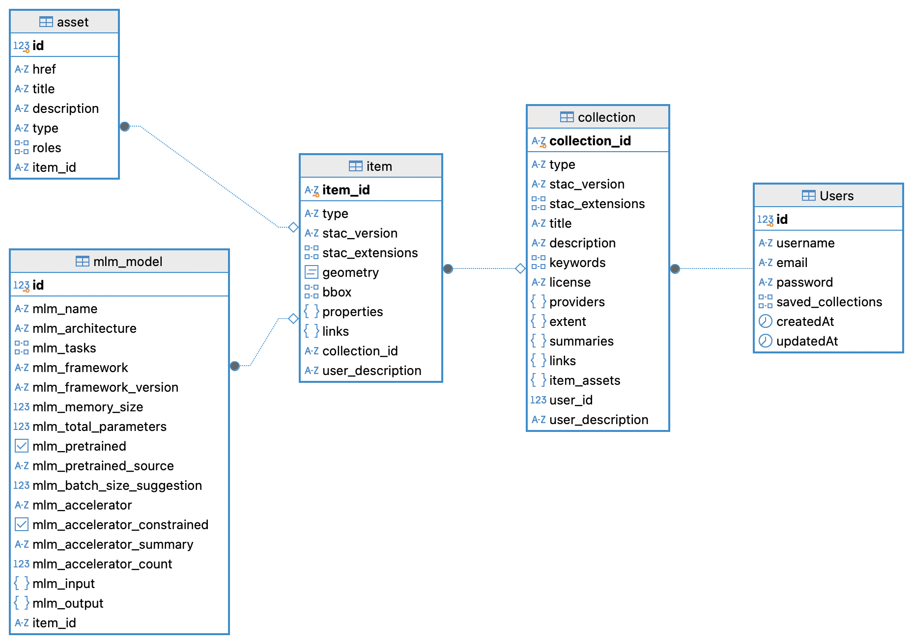

**The German version of the README is available below.**


# HuggingEarth

---

## Project Description

**Web Catalog for ML Models for EO Data**

This project, developed as part of the Geosoftware II course (WiSe 2024/25), aims to create a web-based catalog for the user-friendly search and retrieval of machine learning models specifically designed for Earth Observation (EO) Datacubes.

### Key Features:

- **Model Search & Retrieval:** Search and filter ML models for EO analysis using the STAC MLM extension.
- **Seamless Integration:** Easily integrate models into Python and R workflows through STAC clients (e.g., PySTAC, RSTAC).
- **Metadata Management:** Upload and download spatiotemporal metadata for efficient model access.
- **Community-Driven:** Users can upload their own models and contribute to the catalog.

---

## Installation Guide

### Prerequisites

- Node.js (Version 14 or higher)
- npm or yarn
- Docker and Docker Compose
- PostgreSQL (optional for local deployment without Docker)

### Installation Steps

#### 1. Clone the Repository

```bash
git clone https://github.com/ReinerMx/GS2-2024.git
cd GS2-2024
```

### 2. a) Deployment with Docker
We use the official Node.js image from Docker Hub: [Node.js Image on Docker Hub](https://hub.docker.com/_/node)

A `docker-compose.yml` file is included to simplify container deployment.  
The built image is available: [HuggingEarth on Docker Hub](https://hub.docker.com/r/amlusc/huggingearth)

1. **Ensure Docker and Docker Compose are installed.**  
   If not, install them using the official guides:  
   - [Install Docker](https://docs.docker.com/get-docker/)  
   - [Install Docker Compose](https://docs.docker.com/compose/install/)  

2. **Run the Docker Compose file:**  
   ```bash
   docker-compose up --build
   ```
#### 2. b) Local Deployment
#### Backend Installation

1. Navigate to the backend directory:
   ```bash
   cd backend
   ```
2. Install dependencies:
   ```bash
   npm install
   ```
3. Create a `.env` file and define environment variables:
   ```env
   POSTGRES_DB=gs2_database
   POSTGRES_USER=postgres
   POSTGRES_PASSWORD=mysecretpassword
   POSTGRES_HOST=pgstac
   POSTGRES_PORT=5432
   JWT_SECRET=Geosoftware
   ```
4. Initialize the database:
   ```bash
   npm run migrate
   ```
5. Start the backend:
   ```bash
   npm start
   ```

#### Frontend Installation

1. Navigate to the frontend directory:
   ```bash
   cd ../frontend
   ```
2. Install dependencies:
   ```bash
   npm install
   ```
3. Start the frontend:
   ```bash
   npm start
   ```
---

#### DBeaver Connection Details
1.	Open DBeaver → Create a new connection → Select PostgreSQL
2.	Set the connection parameters:
   - Host: localhost
   - Port: 5432
   - Username: postgres
   - Password: mysecretpassword
   - Database: gs2_database
3.	Test the connection and finish.

---

## Project Structure

```
TerraLink/
├── backend/      # Backend code and API implementations
├── frontend/     # Frontend code
├── docker-compose.yml  # Docker configuration file
├── README.md     # Project overview
├── .env.example  # Example environment variables
└── docs/         # Documentation
```

---
## STAC CORE API Documentation

This API implements the SpatioTemporal Asset Catalog (STAC) Core API, adhering to the official [STAC API Specification](https://github.com/radiantearth/stac-api-spec). Below you will find an overview of the available routes, their descriptions, and usage examples.

### Available Endpoints

#### Root Endpoint:
- `GET /` - Returns the STAC API root with supported conformance classes and links.

#### Conformance:
- `GET /conformance` - Returns the supported conformance classes.

#### Collections:
- `GET /collections` - Fetches all available STAC collections.
- `GET /collections/:collection_id` - Fetches a specific collection by its ID.
  - `collection_id`: Unique identifier of the collection.

#### Items in a Collection:
- `GET /collections/:collection_id/items` - Fetches all items within a specified collection.

#### Item by ID:
- `GET /collections/:collection_id/items/:item_id` - Fetches a specific item within a collection by its ID.
  - `collection_id`: Unique identifier of the collection.
  - `item_id`: Unique identifier of the item.

#### Search:
- `GET /search` 
- `POST /search`
  - The `/search` endpoint allows filtering and querying STAC items based on spatial, temporal, and collection-specific criteria. It returns a STAC-compliant FeatureCollection.

##### Supported Query Parameters:
- `bbox` (optional): Bounding box coordinates specified as `[minX, minY, maxX, maxY]`.  
  Example: `?bbox=10.0,20.0,30.0,40.0`
- `datetime` (optional): Temporal range in ISO 8601 format.  
  Example: `?datetime=2023-01-01T00:00:00Z/2023-12-31T23:59:59Z`
- `collections` (optional): Comma-separated list of collection IDs to limit the search.  
  Example: `?collections=collection1,collection2`
- `limit` (optional): The maximum number of results to return. Default: `10`
- `geoFilter` (optional, POST only): A GeoJSON geometry object for precise spatial filtering.

##### Example Request (GET):
```bash
GET /search?bbox=10.0,20.0,30.0,40.0&datetime=2023-01-01T00:00:00Z/2023-12-31T23:59:59Z&limit=5
```
##### Example Request (POST):
```bash
POST /search
Content-Type: application/json

{
  "bbox": [10.0, 20.0, 30.0, 40.0],
  "datetime": "2023-01-01T00:00:00Z/2023-12-31T23:59:59Z",
  "geoFilter": {
    "type": "Polygon",
    "coordinates": [[[10.0, 20.0], [30.0, 20.0], [30.0, 40.0], [10.0, 40.0], [10.0, 20.0]]]
  },
  "limit": 5
}
```
The response includes metadata for each item, such as geometry, properties, and collection links.

---

### Database Model

The following image illustrates the ER database structure used for STAC-compliant storage of machine learning model data:



This structure adheres to the specifications of [STAC Collections](https://github.com/radiantearth/stac-spec/blob/master/collection-spec/collection-spec.md), [STAC Items](https://github.com/radiantearth/stac-spec/blob/master/item-spec/item-spec.md), and the [MLM STAC Extension](https://github.com/stac-extensions/mlm). These specifications provide a standardized framework for describing spatiotemporal data and machine learning models.

### Table Summary
For a detailed description, visit our [Tutorials Page](http://localhost:5555/tutorials.html)

1. **Collection**:
   - Follows the [STAC Collection Specification](https://github.com/radiantearth/stac-spec/blob/master/collection-spec/collection-spec.md).
   - Stores metadata for a group of related STAC Items, including:
     - `collection_id`: Unique identifier for the collection.
     - `title` and `description`: Provide descriptive details about the collection.
     - `extent`: Spatiotemporal boundaries of the collection.
     - `providers`: List of contributors or data providers.
     - `item_assets`: Definitions of common assets across items in the collection.

2. **Item**:
   - Follows the [STAC Item Specification](https://github.com/radiantearth/stac-spec/blob/master/item-spec/item-spec.md).
   - Represents a single spatiotemporal entity within a collection, including:
     - `item_id`: Unique identifier for the item.
     - `geometry` and `bbox`: Spatial extent of the item.
     - `properties`: Metadata describing temporal coverage and additional details.
     - `links`: Links to related resources or assets.

3. **Asset**:
   - Represents individual assets related to an `Item`.
   - Includes details such as:
     - `href`: URL or path to the asset.
     - `type`: MIME type of the asset (e.g., GeoTIFF, JSON).
     - `roles`: Roles defining the asset's purpose (e.g., data, thumbnail).

4. **MLM Model**:
   - Extends the STAC Item schema using the [MLM STAC Extension](https://github.com/stac-extensions/mlm).
   - Captures metadata specific to machine learning models:
     - `mlm_name`: Name of the model.
     - `mlm_architecture`: Model architecture (e.g., ResNet, Transformer).
     - `mlm_framework`: Framework used (e.g., PyTorch, TensorFlow).
     - `mlm_pretrained`: Indicates if the model is pretrained.
     - `mlm_input` and `mlm_output`: Expected input and output formats of the model.

5. **Users**:
   - Handles user information and preferences:
     - `username`, `email`, and `password`: Basic user details.
     - `saved_collections`: The collections a user uploaded and manages.

### Learn More

For a deeper understanding of the STAC standard and its extensions, refer to:
- [STAC Tutorials on Radiant Earth](https://stacspec.org/)
- [MLM STAC Extension Documentation](https://github.com/stac-extensions/mlm)

and to our
- [Tutorials Page](http://localhost:5555/tutorials.html)

---

## Usage

### Model Upload

1. Log in or register through the user interface.
2. Navigate to the upload page.
3. Upload:
   - The model (JSON metadata in STAC format).
   - An optional description.

### Model Search and Download

1. Use the search bar and filter options to browse models.
2. Click on a specific model for detailed information.
3. Use the provided link to access the related GitHub repository for further use.
4. Integrate models and metadata into workflows using PySTAC or RSTAC.

### Using PySTAC and RSTAC

To integrate STAC data into Python or R workflows, PySTAC (for Python) and RSTAC (for R) can be used. These libraries allow searching, retrieving, and processing STAC-compliant metadata for machine learning models.

Example using PySTAC:
```bash
import pystac_client

catalog = pystac_client.Client.open("http://localhost:5555")
collections = catalog.get_collections()
print([col.id for col in collections])
```

Example using RSTAC:
```bash
library(rstac)

stac_url <- "http://localhost:5555"
catalog <- stac(stac_url) %>% collections()
print(catalog)
```
For detailed guides and more examples, visit our [Tutorials Page](http://localhost:5555/tutorials.html).

---

## Access Rights for Different User Roles

| Role         | API Access | Upload  | Edit             | Delete           |
|-------------|------------|---------|------------------|------------------|
| **Guest**   | ✅ Read   | ❌ No  | ❌ No           | ❌ No           |
| **Registered** | ✅ Read | ✅ Yes | ❌ No           | ❌ No           |
| **Model Owner** | ✅ Read | ✅ Yes | ✅ Own models  | ✅ Own models  |

--- 

## Continuous Integration (CI/CD)

The platform uses **GitHub Actions** for CI/CD.

- **Automated Testing:** Tests are executed for every pull request.
- **Docker Builds:** Docker images are automatically built and published to Docker Hub.

**Configuration:**

- `.github/workflows/ci.yml`

---

## License

This project is released under the MIT License. See [LICENSE](LICENSE) for more details.

---

**Developed by:** Amelie Julia Luschnig, Jakub Zahwe, Lukas Ahlert, Maximilian Reiner, and Lara Sieksmeier

**Instructors:** Brian Pondi, Christian Knoth

---
<!--  -->


---
---
# GERMAN VERSION
---
---

# HuggingEarth

---

## Projektbeschreibung

**Webkatalog für ML-Modelle für EO-Daten**

Dieses Projekt, entwickelt im Rahmen des Geosoftware II Kurses (WiSe 2024/25), zielt darauf ab, einen webbasierten Katalog für die benutzerfreundliche Suche und den Abruf von Machine-Learning-Modellen zu erstellen, die speziell für Earth Observation (EO) Datacubes entwickelt wurden.

### Hauptfunktionen:

- **Modellsuche & -abruf:** Durchsuchen und Filtern von ML-Modellen für EO-Analysen mithilfe der STAC MLM-Erweiterung.
- **Einfache Integration:** Nahtlose Integration in Python- und R-Workflows über STAC-Clients (z. B. PySTAC, RSTAC).
- **Metadaten-Management:** Hochladen und Herunterladen von raum-zeitlichen Metadaten für effizienten Modellzugriff.
- **Community-Driven:** Benutzer können eigene Modelle hochladen und zum Katalog beitragen.

---

## Installationsanleitung

### Voraussetzungen

- Node.js (Version 14 oder höher)
- npm oder yarn
- Docker und Docker Compose
- PostgreSQL (optional bei lokalem Deployment ohne Docker)

### Schritte zur Installation

#### 1. Repository klonen

```bash
git clone https://github.com/ReinerMx/GS2-2024.git
cd GS2-2024
```

### 2. a) Deployment mit Docker

Wir verwenden das offizielle Node.js-Image von Docker Hub: [Node.js-Image auf Docker Hub](https://hub.docker.com/_/node)

Eine `docker-compose.yml`-Datei ist enthalten, um die Bereitstellung des Containers zu vereinfachen.  
Das erstellte Image ist verfügbar: [HuggingEarth auf Docker Hub](https://hub.docker.com/r/amlusc/huggingearth)

#### Voraussetzungen  
1. **Stellen Sie sicher, dass Docker und Docker Compose installiert sind.**  
   Falls nicht, können sie mit den offiziellen Anleitungen installiert werden:  
   - [Docker installieren](https://docs.docker.com/get-docker/)  
   - [Docker Compose installieren](https://docs.docker.com/compose/install/)  

2. **Docker Compose Datei ausführen:**  
   ```bash
   docker-compose up --build
   ```
#### 2. b) Lokales Deployment
#### Backend-Installation

1. Wechseln Sie ins Backend-Verzeichnis:
   ```bash
   cd backend
   ```
2. Abhängigkeiten installieren:
   ```bash
   npm install
   ```
3. `.env`-Datei erstellen und Umgebungsvariablen definieren:
   ```env
   POSTGRES_DB=gs2_database
   POSTGRES_USER=postgres
   POSTGRES_PASSWORD=mysecretpassword
   POSTGRES_HOST=pgstac
   POSTGRES_PORT=5432
   JWT_SECRET=Geosoftware
   ```
4. Datenbank initialisieren:
   ```bash
   npm run migrate
   ```
5. Backend starten:
   ```bash
   npm start
   ```

#### Frontend-Installation

1. Wechseln Sie ins Frontend-Verzeichnis:
   ```bash
   cd ../frontend
   ```
2. Abhängigkeiten installieren:
   ```bash
   npm install
   ```
3. Frontend starten:
   ```bash
   npm start
   ```
---

#### DBeaver Verbindungsdetails
1.	DBeaver öffnen → Neue Verbindung erstellen → PostgreSQL auswählen
2.	Verbindungsparameter setzen:
   - Host: localhost
   - Port: 5432
   - Benutzername: postgres
   - Passwort: mysecretpassword
   - Datenbank: gs2_database
3.	Verbindung testen und abschließen.

 ---

## Projektstruktur

```
HuggingEarth/
├── backend/      # Backend-Code und API-Implementierungen
├── frontend/     # Frontend-Code
├── docker-compose.yml  # Docker-Konfigurationsdatei
├── README.md     # Projektübersicht
├── .env.example  # Beispiel für Umgebungsvariablen
└── docs/         # Dokumentation
```

---

## STAC CORE API Dokumentation

Diese API implementiert die SpatioTemporal Asset Catalog (STAC) Core API und entspricht der offiziellen [STAC API-Spezifikation](https://github.com/radiantearth/stac-api-spec). Im Folgenden finden Sie eine Übersicht der verfügbaren Endpunkte, deren Beschreibungen und Anwendungsbeispiele.

### Verfügbare Endpunkte

#### Root Endpoint:
- `GET /` - Gibt die STAC-API-Wurzel mit unterstützten Konformitätsklassen und Links zurück.

#### Conformance:
- `GET /conformance` - Gibt die unterstützten Konformitätsklassen zurück.

#### Collections:
- `GET /collections` - Ruft alle verfügbaren STAC-Collections ab.
- `GET /collections/:collection_id` - Ruft eine bestimmte Collection anhand ihrer ID ab.
  - `collection_id`: Eindeutige Kennung der Collection.

#### Items in einer Collection:
- `GET /collections/:collection_id/items` - Ruft alle Items innerhalb einer bestimmten Collection ab.

#### Item anhand der ID:
- `GET /collections/:collection_id/items/:item_id` - Ruft ein bestimmtes Item innerhalb einer Collection anhand seiner ID ab.
  - `collection_id`: Eindeutige Kennung der Collection.
  - `item_id`: Eindeutige Kennung des Items.

#### Suche:
- `GET /search` 
- `POST /search`
  - Der Endpunkt `/search` ermöglicht das Filtern und Abfragen von STAC-Items basierend auf räumlichen, zeitlichen und kollektionsspezifischen Kriterien. Die Antwort ist eine STAC-konforme `FeatureCollection`.

##### Unterstützte Abfrageparameter:
- `bbox` (optional): Bounding-Box-Koordinaten angegeben als `[minX, minY, maxX, maxY]`.  
  Beispiel: `?bbox=10.0,20.0,30.0,40.0`
- `datetime` (optional): Zeitbereich im ISO 8601-Format.  
  Beispiel: `?datetime=2023-01-01T00:00:00Z/2023-12-31T23:59:59Z`
- `collections` (optional): Kommagetrennte Liste von Collection-IDs zur Einschränkung der Suche.  
  Beispiel: `?collections=collection1,collection2`
- `limit` (optional): Maximale Anzahl der zurückzugebenden Ergebnisse. Standard: `10`
- `geoFilter` (optional, nur POST): Ein GeoJSON-Objekt zur genauen räumlichen Filterung.

##### Beispielanfrage (GET):
```bash
GET /search?bbox=10.0,20.0,30.0,40.0&datetime=2023-01-01T00:00:00Z/2023-12-31T23:59:59Z&limit=5
```
##### Beispielanfrage (POST):
```bash
POST /search
Content-Type: application/json

{
  "bbox": [10.0, 20.0, 30.0, 40.0],
  "datetime": "2023-01-01T00:00:00Z/2023-12-31T23:59:59Z",
  "geoFilter": {
    "type": "Polygon",
    "coordinates": [[[10.0, 20.0], [30.0, 20.0], [30.0, 40.0], [10.0, 40.0], [10.0, 20.0]]]
  },
  "limit": 5
}
```
Die Antwort enthält Metadaten für jedes Item, wie Geometrie, Eigenschaften und Links zur Collection.

---
### Datenbankmodell

Das folgende Bild zeigt die ER-Datenbankstruktur, die für die STAC-konforme Speicherung von Machine-Learning-Modelldaten verwendet wird:


Diese Struktur basiert auf den Spezifikationen von [STAC Collections](https://github.com/radiantearth/stac-spec/blob/master/collection-spec/collection-spec.md), [STAC Items](https://github.com/radiantearth/stac-spec/blob/master/item-spec/item-spec.md) und der [MLM STAC Extension](https://github.com/stac-extensions/mlm). Diese Spezifikationen bieten einen standardisierten Rahmen zur Beschreibung von räumlich-zeitlichen Daten und Machine-Learning-Modellen.

### Tabellenübersicht
Weitere Details finden Sie auf unserer [Tutorial-Seite](http://localhost:5555/tutorials.html).

1. **Collection**:
   - Basierend auf der [STAC Collection Spezifikation](https://github.com/radiantearth/stac-spec/blob/master/collection-spec/collection-spec.md).
   - Speichert Metadaten für eine Gruppe verwandter STAC-Items, einschließlich:
     - `collection_id`: Eindeutige Kennung der Collection.
     - `title` und `description`: Beschreibende Details zur Collection.
     - `extent`: Räumlich-zeitliche Grenzen der Collection.
     - `providers`: Liste der Datenanbieter oder Mitwirkenden.
     - `item_assets`: Definitionen von gemeinsamen Assets innerhalb der Collection.

2. **Item**:
   - Basierend auf der [STAC Item Spezifikation](https://github.com/radiantearth/stac-spec/blob/master/item-spec/item-spec.md).
   - Repräsentiert eine einzelne räumlich-zeitliche Entität innerhalb einer Collection, einschließlich:
     - `item_id`: Eindeutige Kennung des Items.
     - `geometry` und `bbox`: Räumliche Ausdehnung des Items.
     - `properties`: Metadaten, die zeitliche Abdeckung und zusätzliche Details beschreiben.
     - `links`: Links zu verwandten Ressourcen oder Assets.

3. **Asset**:
   - Repräsentiert einzelne Assets, die zu einem `Item` gehören.
   - Enthält Details wie:
     - `href`: URL oder Pfad zum Asset.
     - `type`: MIME-Typ des Assets (z. B. GeoTIFF, JSON).
     - `roles`: Rollen, die den Zweck des Assets definieren (z. B. `data`, `thumbnail`).

4. **MLM Model**:
   - Erweitert das STAC-Item-Schema mit der [MLM STAC Extension](https://github.com/stac-extensions/mlm).
   - Erfasst spezifische Metadaten für Machine-Learning-Modelle:
     - `mlm_name`: Name des Modells.
     - `mlm_architecture`: Modellarchitektur (z. B. ResNet, Transformer).
     - `mlm_framework`: Verwendetes Framework (z. B. PyTorch, TensorFlow).
     - `mlm_pretrained`: Gibt an, ob das Modell vortrainiert ist.
     - `mlm_input` und `mlm_output`: Erwartete Eingabe- und Ausgabeformate des Modells.

5. **Users**:
   - Verarbeitet Benutzerinformationen und -einstellungen:
     - `username`, `email` und `password`: Grundlegende Benutzerdetails.
     - `saved_collections`: Die Collections, die ein Benutzer hochgeladen hat.
---

## Nutzung

### Modell-Upload

1. Melden Sie sich an oder registrieren Sie sich über die Benutzeroberfläche.
2. Navigieren Sie zur Upload-Seite.
3. Laden Sie:
   - Das Modell (JSON-Metadaten im STAC-Format) hoch.
   - Eine optionale Beschreibung hoch.

### Modell-Suche und -Download

1. Verwenden Sie die Suchleiste und Filteroptionen, um Modelle zu durchsuchen.
2. Klicken sie auf ein spezifisches Modell um mehr Details zu erfahren.
3. Gelangen Sie über den bereitgestellten Link zum zugehörige GitHub Repository, um somit das Modell nutzen zu können.
4. Nutzen Sie PySTAC oder RSTAC, um Modelle und Metadaten in Ihren Workflow zu integrieren.

### Using PySTAC and RSTAC

Zur Integration von STAC-Daten in Python- oder R-Workflows können PySTAC (für Python) und RSTAC (für R) verwendet werden. Diese Bibliotheken ermöglichen das Durchsuchen, Abrufen und Verarbeiten von STAC-konformen Metadaten für Machine-Learning-Modelle.

Beispiel für PySTAC:
```bash
import pystac_client

catalog = pystac_client.Client.open("http://localhost:5555")
collections = catalog.get_collections()
print([col.id for col in collections])
```

Beispiel für RSTAC:
```bash
library(rstac)

stac_url <- "http://localhost:5555"
catalog <- stac(stac_url) %>% collections()
print(catalog)
```
Für detaillierte Anleitungen und weitere Beispiele besuchen Sie unsere [Tutorials Page](http://localhost:5555/tutorials.html).

---

## Zugriffsrechte für verschiedene Nutzer Rollen

| Rolle         | API-Zugriff | Hochladen | Bearbeiten         | Löschen           |
|--------------|------------|-----------|---------------------|--------------------|
| **Gast**     | ✅ Lesen   | ❌ Nein   | ❌ Nein            | ❌ Nein           |
| **Registriert** | ✅ Lesen | ✅ Ja    | ❌ Nein            | ❌ Nein           |
| **Modell-Eigentümer** | ✅ Lesen | ✅ Ja | ✅ Eigene Modelle | ✅ Eigene Modelle |

---

## Continuous Integration (CI/CD)

Die Plattform nutzt **GitHub Actions** für CI/CD.

- **Automatisierte Tests:** Bei jedem Pull-Request werden Tests ausgeführt.
- **Docker-Builds:** Docker-Images werden automatisch erstellt und auf Docker Hub veröffentlicht.

**Konfiguration:**

- `.github/workflows/ci.yml`

---

## Lizenz

Dieses Projekt wird unter der MIT-Lizenz veröffentlicht. Siehe [LICENSE](LICENSE) für weitere Informationen.

---

**Entwickelt von:** Amelie Julia Luschnig, Jakub Zahwe, Lukas Ahlert, Maximilian Reiner und Lara Sieksmeier

**Dozenten:** Brian Pondi, Christian Knoth

---
<!--  -->
